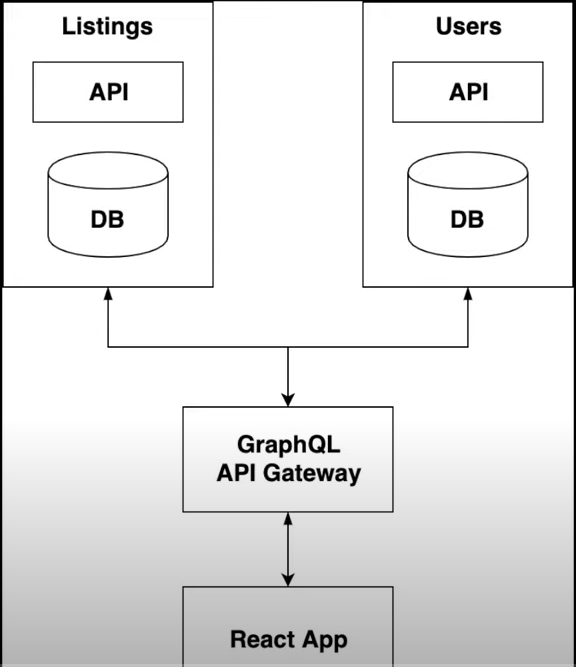

# Microservices App with Docker & GraphQL



**Two Services**

1. Listing
2. Users

API Gateway is used to connect the services.

Both listing and users services are similar.

# Setting Listing Services

1. Initally set the listing service

   ```bash
   $ yarn init -y //initialise

   $ yarn add -D babel-watch //to view changes locally even within Docker

   $ yarn add @babel/core @babel/polyfill @babel/preset-env babel-plugin-module-resolver
   ```

2. Within listing-service folder create a new file `babel.config.js`

3. In babel.config.js add below text

   ```js
   module.exports = {
     plugins: [
       [
         "module-resolver",
         {
           alias: {
             "#root": "./src",
           },
         },
       ],
     ],
     presets: [
       [
         "@babel/preset-env",
         {
           targets: {
             node: "current",
           },
         },
       ],
     ],
   };
   ```

4. Now in package.json, add scripts tag with watch command to do polling whenever changes are made.

   ```js
   "scripts": {
     "watch" : "babel-watch -L src/index.js"
   }
   ```

5. Create a `src` folder with `index.js` file.

6. Add below line and run `yarn watch` to check whether babel is configured properly

   ```js
   import path from "path";
   console.log("Working");
   ```

   If no error has occurred, then babel is configured properly.

7. Create a file `Dockerfile` for this listing service which consists configuration of it.

8. Insider `Dockerfile` add below to configure

   ```js
   FROM node:12

   COPY . /opt/app

   WORKDIR /opt/app

   RUN yarn

   CMD yarn watch
   ```

9. Now run `docker build .` to build docker images

10. Copy all files (except node_modules) to users-service folder, change
    the package name to `users-service` then inside that folder run `yarn` &
    `docker build .`

11. Now inside the root directory, create `docker-compose.yml` (.yml - an extension of JSON) and
    add below configurations

    ```yml
    version: "3"

    services:

      listing-service:
        build: "./listing-service"
        depends_on:
          - listing-service-db
        volumes:
          - ./listing-service:/opt/app

      listing-service-db:
        environment:
          - MYSQL_ROOT_PASSWORD=password
          - MYSQL_DATABASE = db
        image: mysql:5.7.20

      users-service:
        build: "./users-service"
        depends_on:
          - users-service-db
        volumes:
          - ./users-service:/opt/app

      users-service-db:
        environment:
          - MYSQL_ROOT_PASSWORD=password
          - MYSQL_DATABASE = db
        image: mysql:5.7.20
    ```

12. Now in root directory, run the following command:
    `docker-compose up`
